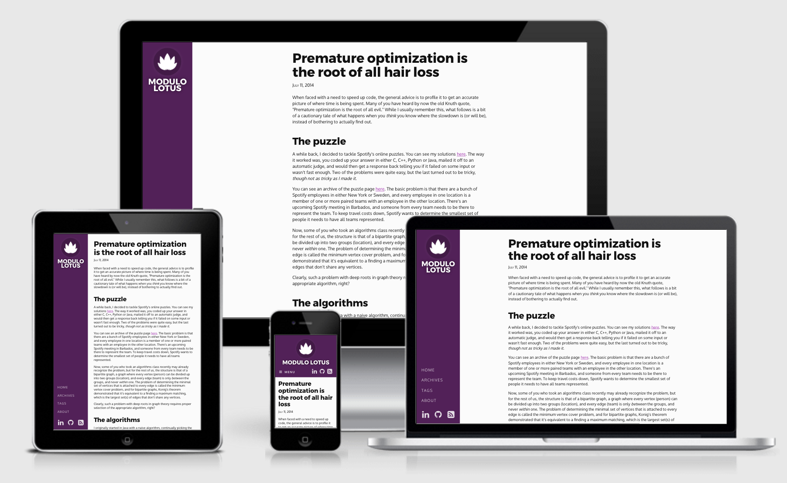

# Lotus theme for Cryogen
An elegant and responsive theme for the [Cryogen](http://cryogenweb.org/) static site generator. To see a demo, visit my site, [modulolotus.net](https://modulolotus.net).

## Dependencies

Requires `cryogen-core` >= 0.1.54.

## Install

Either download or `git clone` the repository, and copy the `lotus` directory under the `resources/templates/themes/` directory.

Next, edit your `config.edn` file. You will have to make 3 changes from the default behavior.

1. Change the `:theme` key to `"lotus"`.
2. Add `"themes/lotus/css"` to the `:sass-src` key. (Remember, all the Sass dirs should be in `[]`, like `["themes/lotus/css"]`.)
3. Add `"themes/lotus/img"` to the :resources key. (E.g., `["themes/lotus/img" "img"]`.)

The sidebar is designed for a narrow width. You may want to insert ` ` tags in your blog's name in `base.html` to make it look nicer.

---------------------------------------
Copyright © 2017 by Matthew Davidson
